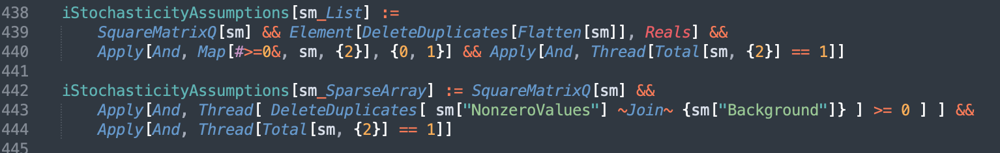

# Wolfram System Integration with Sublime Text

A Sublime Text package for Wolfram Language.

* Syntax highlighting
* [LSP](https://microsoft.github.io/language-server-protocol/) support




## Setup

Sublime-WolframLanguage depends on [LSPServer](https://github.com/WolframResearch/lspserver) to provide LSP functionality.

[Build and install the WolframLanguage package locally](HowToBuild.md)

If properly setup, you should have syntax highlighting and linting of Wolfram `.m` and `.wl` files.

Test this by typing this into a new `.wl` file and saving it:
```
Which[a, b, a, b]
```

You should see warnings about duplicate clauses.


### Settings

If you have Wolfram System installed in the default location on your system, you may not have to change any settings.

If Wolfram System is not in the default location, then specify the actual location:

Go to the menu item:
`Package Settings > Wolfram Language > Settings`

Add a `kernel` setting:
```
{
  …

  "kernel": "/Applications/Mathematica123.app/Contents/MacOS/WolframKernel"

  …
}

```

You may also change the command that is used to start the server:
```
{
  …

  "lsp_server_command":
    [
      "`kernel`",
      "-noinit",
      "-noprompt",
      "-nopaclet",
      "-noicon",
      "-nostartuppaclets",
      "-run",
      "Needs[\"LSPServer`\"];LSPServer`StartServer[]"
    ]

  …
}
```

#### Experimental Settings

You can enable experimental settings. These are not supported.

`implicitTokens` controls the display of implicit tokens such as `Null` after `;` and implicit Times character `×`.

```
{
  …

  "implicitTokens": ["*", ",", ";;", "?"]

  …
}
```


## Troubleshooting

Make sure that the paclets can be found on your system:
```
Needs["LSPServer`"]
```

[Troubleshooting LSP for Sublime Text](https://lsp.sublimetext.io/troubleshooting/)
